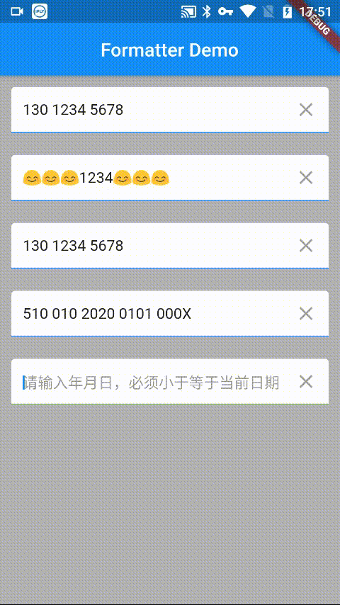
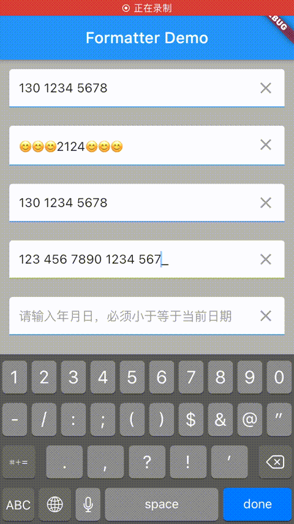

# masked_text_formatter
[](https://pub.dartlang.org/packages/masked_text_formatter)


## English | [中文](README.md)

This package provides TextInputFormatter for TextField/TextFormField widget which format the input
by a given mask.Or provides the formatted string for Text widget which format the text by a given mask.

## Snapshot




## Installation
Add this to your package's pubspec.yaml file:
```
dependencies:
  masked_text_formatter: ^0.0.1
```
## How to use
### Import it
```dart
import 'package:masked_text_formatter/masked_text_formatter.dart';
```
### Create
```dart
//Simple
var maskedFormatter = new MaskedTextFormatter.simple("344");
//Complex
var maskedFormatter = new MaskedTextFormatter.complex("😊😊😊****😊😊😊", mark: "*",
                                        deleteEndPlaceholder: false)
//Mask
var maskedFormatter = new MaskedTextFormatter.mask("000 0000 0000", emptyPlaceholder: "_");
//Custom
var maskedFormatter = new MaskedTextFormatter.custom("000 000 0000 0000 000X",
                                        emptyPlaceholder: "_",
                                        filterRules: {
                                          "X": RegExpMatcher.from(r'[0-9Xx]'),
                                          "0": RegExpMatcher.from(r'[0-9]')
                                        });
```
### Methods
|Name|Params|Desc|
|:---:|:---:|:---:|
|formatMask|String|Provides the formatted string(Can be used to set the text of Text widget)|
|clear|Void|Clear the formartted string|
|getRealText|Void|Get unmasked text|

### License
MIT License

Copyright (c) 2020 dkzwm

Permission is hereby granted, free of charge, to any person obtaining a copy
of this software and associated documentation files (the "Software"), to deal
in the Software without restriction, including without limitation the rights
to use, copy, modify, merge, publish, distribute, sublicense, and/or sell
copies of the Software, and to permit persons to whom the Software is
furnished to do so, subject to the following conditions:

The above copyright notice and this permission notice shall be included in all
copies or substantial portions of the Software.

THE SOFTWARE IS PROVIDED "AS IS", WITHOUT WARRANTY OF ANY KIND, EXPRESS OR
IMPLIED, INCLUDING BUT NOT LIMITED TO THE WARRANTIES OF MERCHANTABILITY,
FITNESS FOR A PARTICULAR PURPOSE AND NONINFRINGEMENT. IN NO EVENT SHALL THE
AUTHORS OR COPYRIGHT HOLDERS BE LIABLE FOR ANY CLAIM, DAMAGES OR OTHER
LIABILITY, WHETHER IN AN ACTION OF CONTRACT, TORT OR OTHERWISE, ARISING FROM,
OUT OF OR IN CONNECTION WITH THE SOFTWARE OR THE USE OR OTHER DEALINGS IN THE
SOFTWARE.